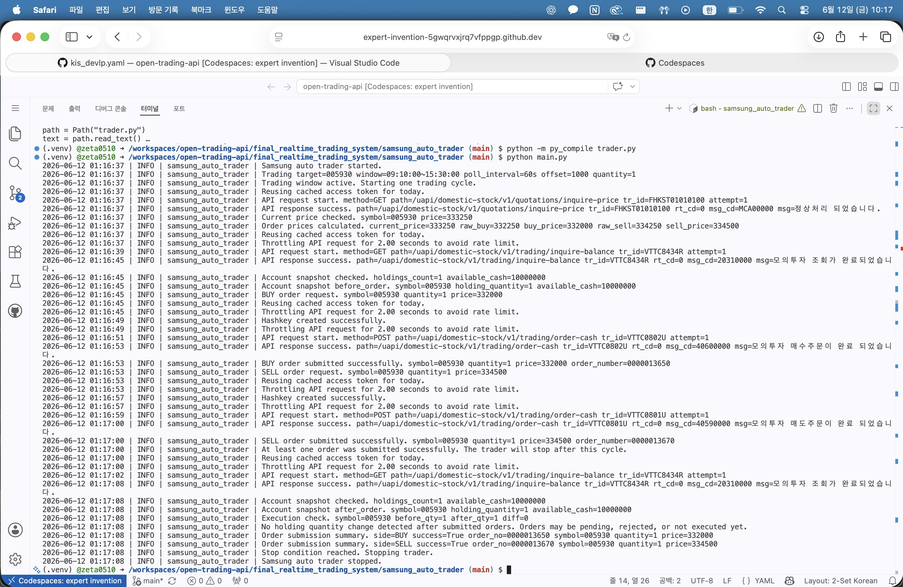

# 인공지능과 금융공학 최종 프로젝트  
# Samsung Auto Trader

한국투자증권 Open API 모의투자 환경을 이용하여 삼성전자(`005930`)를 대상으로 동작하는 REST API 기반 자동매매 시스템입니다.

이 프로젝트는 실전 투자를 목적으로 하지 않으며, 수업 프로젝트 제출을 위해 Open API 인증, 현재가 조회, 계좌 잔고 조회, 주문 가격 계산, 지정가 매수/매도 주문 제출, 주문 후 잔고 확인 과정을 하나의 실행 흐름으로 구현한 것입니다.

최종 구현 코드는 아래 폴더에 있습니다.

```text
final_realtime_trading_system/samsung_auto_trader/
```

---

## 1. 프로젝트 목표

이 프로젝트의 목표는 한국투자증권 Open API를 이용하여 다음 기능을 구현하는 것입니다.

- access token 발급 및 당일 token cache 재사용
- 삼성전자 현재가 조회
- 모의투자 계좌의 예수금 및 보유수량 조회
- 현재가 기준 지정가 매수/매도 가격 계산
- 한국 주식 호가단위에 맞는 주문 가격 보정
- hashkey 생성 후 지정가 주문 제출
- 주문 후 계좌 잔고 재조회
- 반복 주문 방지를 위한 자동 종료

---

## 2. 사용 API

이 프로젝트는 websocket을 사용하지 않고 REST API만 사용합니다.

사용한 주요 API는 다음과 같습니다.

- OAuth token 발급: `/oauth2/tokenP`
- 현재가 조회: `/uapi/domestic-stock/v1/quotations/inquire-price`
- 계좌 잔고 조회: `/uapi/domestic-stock/v1/trading/inquire-balance`
- hashkey 생성: `/uapi/hashkey`
- 현금 주문: `/uapi/domestic-stock/v1/trading/order-cash`

---

## 3. 실행 환경

Python 3 환경에서 실행합니다.

```bash
cd final_realtime_trading_system/samsung_auto_trader
pip install -r requirements.txt
```

---

## 4. 환경변수 설정

API key와 계좌번호는 코드에 직접 작성하지 않고 환경변수로 입력합니다.

필요한 환경변수는 다음과 같습니다.

```text
GH_ACCOUNT
GH_APPKEY
GH_APPSECRET
```

예를 들어 모의투자 계좌가 `50192756-01`이라면 `GH_ACCOUNT`에는 하이픈 없이 다음과 같이 입력합니다.

```text
5019275601
```

GitHub Codespaces를 사용하는 경우 Codespace user secrets에 위 세 값을 등록할 수 있습니다. 실제 APP KEY, APP SECRET, 계좌번호는 GitHub에 commit하지 않습니다.

---

## 5. 실행 방법

```bash
cd final_realtime_trading_system/samsung_auto_trader
python main.py
```

프로그램은 한국 시간 기준 09:10부터 15:30 사이에만 trading cycle을 수행합니다. Codespaces 서버 시간이 UTC일 수 있으므로, 코드에서는 `Asia/Seoul` timezone을 명시적으로 사용합니다.

---

## 6. 시스템 구조

```text
open-trading-api/
├── README.md
└── final_realtime_trading_system/
    └── samsung_auto_trader/
        ├── account.py
        ├── api_client.py
        ├── auth.py
        ├── config.py
        ├── logger.py
        ├── main.py
        ├── market_data.py
        ├── orders.py
        ├── trader.py
        ├── requirements.txt
        └── README.md
```

각 파일의 역할은 다음과 같습니다.

- `main.py`: 전체 시스템 실행 진입점
- `config.py`: 환경변수 및 trading 설정 관리
- `auth.py`: access token 발급 및 cache 관리
- `api_client.py`: 공통 REST API 요청 처리, retry, timeout, throttling, hashkey 생성
- `market_data.py`: 삼성전자 현재가 조회
- `account.py`: 계좌 예수금 및 보유수량 조회
- `orders.py`: 지정가 매수/매도 주문 요청
- `trader.py`: 전체 trading cycle 제어
- `logger.py`: 콘솔 및 파일 logging 설정

---

## 7. Trading Logic

하나의 trading cycle은 다음 순서로 진행됩니다.

1. 삼성전자 현재가를 조회합니다.
2. 현재가보다 낮은 매수 가격과 현재가보다 높은 매도 가격을 계산합니다.
3. 계산된 주문 가격을 한국 주식 호가단위에 맞게 보정합니다.
4. 계좌의 예수금과 보유수량을 조회합니다.
5. 예수금이 충분하면 지정가 매수 주문을 제출합니다.
6. 보유수량이 충분하면 지정가 매도 주문을 제출합니다.
7. 주문 후 계좌 잔고를 다시 조회합니다.
8. 주문 성공 시 반복 주문을 막기 위해 프로그램을 종료합니다.

---

## 8. 호가단위 보정

한국 주식은 가격대별로 허용되는 호가단위가 다릅니다. 따라서 단순히 현재가에서 일정 금액을 더하거나 빼면 주문 가격이 거절될 수 있습니다.

예를 들어 현재가가 `335250`이고 매수 가격을 `334250`으로 계산하면, 해당 가격대의 호가단위에 맞지 않아 주문이 거절될 수 있습니다.

이를 방지하기 위해 매수 가격은 허용 호가단위로 내림하고, 매도 가격은 허용 호가단위로 올림합니다.

실행 예시는 다음과 같습니다.

```text
current_price=333250
raw_buy=332250
buy_price=332000
raw_sell=334250
sell_price=334500
```

---

## 9. API 호출 제한 대응

모의투자 API는 짧은 시간에 너무 많은 요청을 보내면 요청 제한에 걸릴 수 있습니다. 이를 피하기 위해 다음 방식을 사용했습니다.

- API 요청 사이에 최소 대기시간 적용
- token은 당일 cache를 사용하여 불필요한 재발급 방지
- 주문 성공 후 자동 종료
- 주문이 없으면 주문 후 잔고 재조회 생략
- 주문 API는 중복 주문 위험을 줄이기 위해 자동 retry 제한

---

## 10. 안전장치

이 프로젝트는 모의투자 환경을 대상으로 하지만, 반복 주문을 막기 위해 다음 안전장치를 포함합니다.

- 주문 수량 기본값 1주
- 예수금 부족 시 매수 주문 skip
- 보유수량 부족 시 매도 주문 skip
- 주문 성공 후 자동 종료
- access key, secret, 계좌번호는 환경변수로 관리
- `.env`, `token_cache.json`, `logs/`는 commit 대상에서 제외

---

## 11. 실행 결과

실제 한국투자증권 Open API 모의투자 환경에서 삼성전자(`005930`)를 대상으로 실행 테스트를 진행했습니다.



시스템은 다음 과정을 정상적으로 수행했습니다.

1. access token 발급 및 cache 재사용
2. 삼성전자 현재가 REST API 조회
3. 모의투자 계좌 예수금 및 보유수량 조회
4. 주문 가격 호가단위 보정
5. hashkey 생성
6. 지정가 매수 주문 제출
7. 지정가 매도 주문 제출
8. 주문 후 잔고 재조회
9. 주문 성공 후 자동 종료

실행 로그 일부는 다음과 같습니다.

```text
Current price checked. symbol=005930 price=333250
Order prices calculated. current_price=333250 raw_buy=332250 buy_price=332000 raw_sell=334250 sell_price=334500
Account snapshot checked. holdings_count=1 available_cash=10000000
BUY order submitted successfully. symbol=005930 quantity=1 price=332000 order_number=0000013650
SELL order submitted successfully. symbol=005930 quantity=1 price=334500 order_number=0000013670
Stop condition reached. Stopping trader.
Samsung auto trader stopped.
```

지정가 주문은 접수되더라도 즉시 체결되지 않을 수 있습니다. 따라서 주문 직후 보유수량 변화가 없을 수 있으며, 이 경우 시스템은 주문이 미체결 또는 대기 상태일 수 있다고 로그에 남깁니다.

---

## 12. 한계 및 개선 방향

현재 시스템은 수업 프로젝트 제출을 위한 최소 자동매매 시스템입니다. 따라서 다음과 같은 개선 여지가 있습니다.

- 주문 체결 여부를 주문조회 API로 직접 확인
- 미체결 주문 취소 기능 추가
- 여러 종목에 대한 확장
- 매수/매도 전략 고도화
- 로그 기반 거래 이력 저장
- 예외 상황별 복구 로직 강화